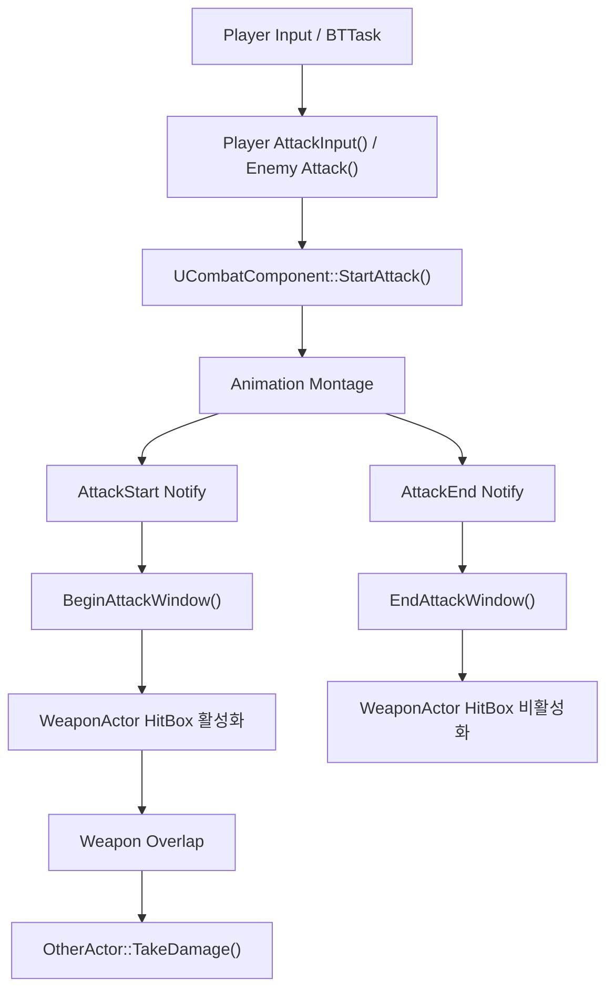

# Combat System

## 목표

전투 시스템은 플레이어와 적이 같은 공격 상태와 무기 로직을 재사용하고, 각 Character가 공격 요청 처리와 Animation Montage 재생을 담당하도록 구성했습니다.

핵심은 공격 상태와 실제 타격 판정 구간을 분리한 점입니다.

- `StartAttack()`: 공격 가능 조건 확인과 `ECombatState::Attack` 전환
- `BeginAttackWindow()` / `EndAttackWindow()`: 무기 HitBox 활성 구간 제어
- Montage 종료 Delegate: 공격 상태를 복구하고, Montage가 중단된 경우에도 HitBox가 비활성화되도록 처리
## 최종 구조

| 구성 요소 | 책임 |
| --- | --- |
| `APlayerCharacter` | 공격 입력, 공격 가능 조건 판단, Player Montage 재생 |
| `AEnemyCharacter` | AI의 공격 요청 수신, 공격 가능 조건 판단, Enemy Montage 재생 |
| `ICombatStateInterface` | Character별 `CanStartAttack()` 조건을 `UCombatComponent`에 제공 |
| `UCombatComponent` | 공통 공격 상태, Weapon 생성·부착·해제, Attack Window 전달 |
| `AWeaponActor` | Weapon Mesh/HitBox, 공격 구간 Collision, 중복 Hit 방지, Damage 전달 |
| `AM_PlayerAttack`, `AM_EnemyAttack` | `AttackStart`와 `AttackEnd` Notify를 포함한 공격 Montage |
| Player/Enemy Animation Blueprint | Notify를 Character의 `BeginAttackWindow()`/`EndAttackWindow()`에 연결 |



## Player / Enemy와 CombatComponent의 관계

Player와 Enemy는 모두 `UCombatComponent`를 사용하고 `ICombatStateInterface`를 구현합니다.

`UCombatComponent::StartAttack()`은 구체적인 Character 타입을 직접 검사하지 않고, `ICombatStateInterface::CanStartAttack()`을 통해 각 Character가 자신의 공격 가능 여부를 판단하도록 합니다.

현재 허용 조건은 다음과 같습니다.

| Character | `CanStartAttack()` 조건 |
| --- | --- |
| Player | Dead가 아니고, Stunned가 아니며, Dash 중이 아님 |
| Enemy | Dead가 아님 |

이를 통해 `UCombatComponent`는 Player의 Dash/Stun 상태나 Enemy의 생존 상태를 직접 알지 않고 공통 공격 흐름만 관리합니다.
## Weapon 생성과 부착

`UCombatComponent::BeginPlay()`는 다음 순서로 Weapon을 준비합니다.

1. Owner를 `ACharacter`와 `ICombatStateInterface`로 확인
2. Blueprint에서 지정된 `WeaponClass` 생성
3. Owner와 Instigator 설정
4. Character Mesh의 `RightHand` Socket에 부착
5. `bWeaponVisible` 상태 적용

Player와 Enemy는 각각 별도의 Weapon Class를 사용하며, 각 무기는 자신의 공격 대상만 Overlap하도록 Collision을 구분해 설정합니다.
| Profile | Overlap 대상 | Ignore 대상 |
| --- | --- | --- |
| `PlayerWeapon` | `Enemy` | `Player` 및 그 외 기본 채널 |
| `EnemyWeapon` | `Player` | `Enemy` 및 그 외 기본 채널 |

Component가 종료될 때는 자신이 생성한 무기를 `Destroy()`하고 포인터를 비웁니다.

## 공격 동작 흐름

### 1. 공격 시작

Player는 Enhanced Input의 `IA_Attack` Started 이벤트에서 `AttackInput()`을 호출합니다. Enemy는 Behavior Tree의 `UBTTask_Attack`이 `AEnemyCharacter::Attack()`을 호출합니다. 두 경로 모두 다음 공통 순서를 사용합니다.

```cpp
if (!CombatComponent->StartAttack())
    return;

const float MontageLength = AnimInstance->Montage_Play(AttackMontage);

if (MontageLength <= 0.0f)
{
    CombatComponent->EndAttack();
    return;
}
```

`StartAttack()`이 성공해 공격 상태가 `Attack`으로 변경된 경우에만 Montage를 재생합니다. 재생 실패 시 즉시 `EndAttack()`을 호출해 상태가 `Attack`에 남지 않게 합니다.

### 2. Animation Montage / Notify

`AM_PlayerAttack`과 `AM_EnemyAttack`에는 공격 판정 구간의 시작과 종료를 알리는 `AttackStart`, `AttackEnd` Notify가 설정되어 있습니다.

각 Animation Blueprint는 해당 Notify를 수신하면 Character의 `BeginAttackWindow()`와 `EndAttackWindow()`를 호출하여 HitBox의 활성 구간을 제어합니다. 
Character는 이를 `UCombatComponent`로 전달하고, CombatComponent가 Weapon의 Attack Window를 제어합니다.

### 3. Attack Window와 Hit 판정

`UCombatComponent::BeginAttackWindow()`는 공격 중일 때 Weapon의 Attack Window를 시작합니다. `AWeaponActor`는 공격 구간이 시작되면 이전 Hit 목록을 초기화하고 HitBox를 활성화합니다.

Overlap이 발생하면 유효한 대상인지 확인하고, 이번 공격에서 이미 Hit한 Actor라면 무시합니다. 처음 Hit한 대상은 `HitActors`에 기록한 뒤 `TakeDamage()`를 호출합니다.
### 4. Damage 처리

Weapon은 구체적인 Health 클래스에 직접 접근하지 않고 Unreal의 `TakeDamage()`를 호출합니다. Player와 Enemy는 각자의 `TakeDamage()` Override에서 `Super::TakeDamage()`가 반환한 실제 Damage를 확인한 뒤 자신의 `UHealthComponent::ApplyDamage()`로 전달합니다.

이후 체력 변경과 사망 처리 흐름은 [Health & UI](HealthAndUI.md)에 정리되어 있습니다.

### 5. 공격 종료와 상태 복구

Player와 Enemy는 Montage 재생에 성공하면 종료 Delegate를 등록하고, Montage가 끝나거나 중단될 때 `CombatComponent->EndAttack()`을 호출합니다.

따라서 `AttackEnd` Notify가 호출되지 못한 중단 상황에서도 HitBox를 비활성화하고 공격 상태를 `None`으로 복구합니다.
## 주요 설계 결정

* **공격 상태와 실제 타격 구간을 분리**

  입력부터 Montage 종료까지의 전체 공격 상태는 `ECombatState`로 관리하고, 실제 Damage가 가능한 구간은 Weapon의 Attack Window가 담당하도록 분리했습니다. 공격 중 여부와 실제 판정 가능 시간을 따로 관리해 Animation 길이와 타격 판정 구간을 독립적으로 조정할 수 있도록 했습니다.

* **Character별 공격 가능 조건은 Interface에서 판단**

  `UCombatComponent`가 Player의 Dash/Stun 상태나 Enemy의 Life 상태를 직접 확인하지 않고, 각 Character가 Interface를 통해 공격 가능 여부를 판단하도록 구성했습니다. 이를 통해 공통 CombatComponent가 특정 Character의 상태 구조에 의존하지 않도록 했습니다.

* **Weapon은 체력 로직을 직접 처리하지 않음**

  `AWeaponActor`는 타격 대상의 구체적인 체력 구현을 알지 않고 `TakeDamage()`만 호출합니다. 이후 피해를 받은 Character의 `TakeDamage()`가 자신의 `UHealthComponent`에 Damage를 전달하도록 해 Weapon이 체력 시스템에 직접 의존하지 않도록 했습니다.

* **한 번의 공격에서 같은 대상을 중복 타격하지 않도록 제한**

  Attack Window 동안 타격한 Actor를 `TSet<AActor*>`에 저장하고, 이미 처리한 대상의 추가 Overlap은 무시합니다. 하나의 공격 동작에서 같은 대상에게 Damage가 여러 번 적용되는 것을 방지하고, 새로운 Attack Window가 시작될 때 목록을 초기화합니다.

## 개발 중 문제와 해결

### PlayerCharacter에 몰려 있던 무기 책임 분리

초기에는 `APlayerCharacter`가 `WeaponComponent`, `WeaponHitBox`, `WeaponMesh`, 공격 Timer, Overlap Damage 처리까지 직접 담당했습니다.

이 구조에서는 Character가 입력과 상태 처리뿐 아니라 무기 충돌과 Damage 처리까지 함께 책임지게 되어 역할이 과도하게 커졌습니다.

Weapon의 Mesh/HitBox와 공격 구간 Collision, Damage 처리를 AWeaponActor로 분리하고, Weapon 생성과 부착 및 공통 제어는 이후 UCombatComponent가 담당하도록 정리했습니다. 이후 `APlayerCharacter`는 직접 타격을 처리하지 않고 공격 요청과 Montage 재생을 담당하도록 역할을 축소했습니다.
### Player와 Enemy에 공통으로 필요한 전투 처리 분리

Enemy 공격을 추가하면서 Player와 Enemy 모두 공격 상태 관리, Weapon 제어처럼 비슷한 전투 흐름을 필요로 하게 되었습니다.

처음에는 이러한 처리를 각 Character가 직접 가지고 있었지만, 구현을 이어가면서 공통으로 사용할 수 있는 로직이 Character별로 나뉘어 있는 점이 아쉬웠습니다. 그래서 공격 상태와 Weapon 제어를 `UCombatComponent`로 분리해 Player와 Enemy가 함께 사용하도록 변경했습니다.

반면 공격 가능 조건은 Character마다 달랐습니다. Player는 Dash/Stun 등의 상태를 확인하고, Enemy는 생존 상태를 확인해야 하므로 이 조건까지 `UCombatComponent`가 직접 알도록 하지는 않았습니다.

따라서 공격 가능 여부는 `ICombatStateInterface::CanStartAttack()`을 통해 각 Character가 직접 판단하고, `UCombatComponent`는 공통 전투 흐름만 담당하도록 구성했습니다.
### AI 공격 진입점 정리

초기에는 `UBTTask_Attack`이 `CombatComponent->StartAttack()`을 직접 호출했습니다.

Enemy의 공격 Animation Montage를 추가하면서 공격 시작 이후 Character가 Montage 재생까지 처리해야 했기 때문에, 공격 진입점을 `AEnemyCharacter::Attack()`으로 변경했습니다.

현재 Behavior Tree Task는 Enemy에게 공격만 요청하고, `AEnemyCharacter::Attack()`이 내부에서 `CombatComponent->StartAttack()`과 Montage 재생을 처리합니다.


이를 통해 Behavior Tree는 공격의 구체적인 구현 방법을 알 필요 없이 Character의 행동 단위만 호출하도록 정리했습니다.
## 관련 소스

- `Source/Roguelike/Components/Combat/CombatComponent.h/.cpp`
- `Source/Roguelike/Weapons/WeaponActor.h/.cpp`
- `Source/Roguelike/Core/Interfaces/CombatStateInterface.h/.cpp`
- `Source/Roguelike/Core/Types/CharacterStates.h`
- `Source/Roguelike/Characters/Player/PlayerCharacter.h/.cpp`
- `Source/Roguelike/Characters/Enemy/EnemyCharacter.h/.cpp`
- `Source/Roguelike/AI/BTTask_Attack.h/.cpp`
- `Config/DefaultEngine.ini`
