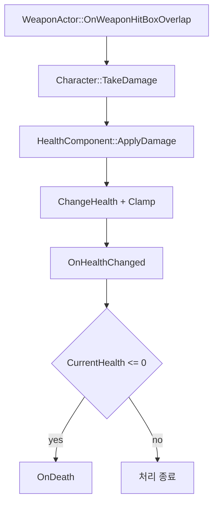

# Health and UI

## 목표

Player와 Enemy가 공통으로 사용하는 체력 상태와 변경 로직을 `UHealthComponent`로 분리하고, 체력 변경과 사망을 Delegate로 전달합니다. Character는 `TakeDamage()`에서 Damage를 `UHealthComponent`에 전달하고, 사망 후 처리는 각 Character가 담당합니다. UI는 초기 표시를 위해 Component의 현재 값을 읽고, 이후 `OnHealthChanged`를 구독해 변경된 체력을 반영합니다.

Player UI와 Enemy HealthBar는 표시 위치와 연결 방식이 다릅니다.

- Player: PlayerController가 Viewport UI를 생성하고, `WBP_PlayerMainUI`가 Player HealthComponent와 연결됩니다.
- Enemy: Enemy Actor에 붙은 `UHealthBarComponent`가 Owner의 HealthComponent를 찾아 Screen Space Widget을 갱신합니다.

## 최종 구조

| 구성 요소 | 책임 |
| --- | --- |
| `UHealthComponent` | Max/Current Health, Heal()/ApplyDamage(), Clamp, 변경·사망 Delegate |
| `APlayerCharacter` | Damage를 HealthComponent로 전달, 사망 시 Game Over 처리 요청, 체력 Getter 제공 |
| `AEnemyCharacter` | Damage를 HealthComponent로 전달, 사망 시 아이템 Drop·방 알림·Destroy |
| `ARoguelikePlayerController` | Local Controller에서 Player Main UI 생성·Viewport 등록 |
| `WBP_PlayerMainUI` | Player의 HealthComponent와 연결하고 체력 변경 Delegate를 통해 Player HealthBar 갱신 |
| `WBP_HealthBar` | Player UI 내부 ProgressBar 갱신 |
| `UHealthBarComponent` | Enemy Owner의 HealthComponent 검색·Delegate 구독·Widget 갱신 |
| `UHealthBarWidget` | `PB_Health` ProgressBar의 Percent 계산 |
| `WBP_EnemyHealthBar` | Enemy의 현재 체력을 ProgressBar 형태로 표시 |
| `AHealItem` | Player Overlap 시 HealthComponent를 찾아 Heal 적용 후 제거 |

## 체력 변경 흐름



## HealthComponent

### 초기화

`UHealthComponent`는 Tick을 사용하지 않습니다. 체력 초기값은 Component 내부에 고정하지 않고, Character가 DataTable에서 자신의 최대 체력을 읽어 `InitializeHealth()`를 호출하는 방식으로 설정합니다.

Player와 Enemy는 각각 `DT_CharacterStats`에서 자신의 Row를 조회한 뒤 `MaxHealth` 값을 `UHealthComponent`에 전달합니다.

```cpp
if (CharacterStatTable && HealthComponent)
{
    const FCharacterStatData* PlayerStat =
        CharacterStatTable->FindRow<FCharacterStatData>(
            FName(TEXT("Player")),
            TEXT("PlayerCharacter")
        );

    if (PlayerStat)
    {
        HealthComponent->InitializeHealth(PlayerStat->MaxHealth);
    }
}
```

`InitializeHealth()`는 전달받은 최대 체력을 저장하고 현재 체력을 최대 체력으로 설정한 뒤 사망 상태를 초기화합니다. 이후 변경량 `0.0f`로 `OnHealthChanged`를 Broadcast하여 초기 UI 상태도 갱신할 수 있도록 합니다.

```cpp
void UHealthComponent::InitializeHealth(float InMaxHealth)
{
    MaxHealth = FMath::Max(0.0f, InMaxHealth);
    CurrentHealth = MaxHealth;
    bDead = false;

    OnHealthChanged.Broadcast(
        CurrentHealth,
        MaxHealth,
        0.0f
    );
}
```

이 구조를 통해 `UHealthComponent`는 Player나 Enemy의 구체적인 데이터 출처를 알 필요 없이 전달받은 체력 값을 관리하고, Character별 초기 능력치는 DataTable에서 관리할 수 있습니다.

### Heal과 Damage

외부에는 `Heal()`과 `ApplyDamage()`를 나누어 노출하고, 실제 값 변경은 private `ChangeHealth()` 하나로 통합합니다.

```cpp
void UHealthComponent::ChangeHealth(float Amount)
{
    if (Amount == 0.0f || bDead)
        return;

    const float OldHealth = CurrentHealth;

    CurrentHealth = FMath::Clamp(
        CurrentHealth + Amount,
        0.0f,
        MaxHealth
    );

    const float ChangedAmount = CurrentHealth - OldHealth;
    if (FMath::IsNearlyZero(ChangedAmount))
        return;

    OnHealthChanged.Broadcast(
        CurrentHealth,
        MaxHealth,
        ChangedAmount
    );

    if (CurrentHealth <= 0.0f)
    {
        bDead = true;
        OnDeath.Broadcast();
    }
}
```

Delegate의 `ChangedAmount`는 요청한 값이 아니라 Clamp 적용 후 실제로 변한 체력 값입니다. 최대 체력에서 추가 Heal을 시도하는 등 실제 체력이 변하지 않은 경우에는 `OnHealthChanged`를 발생시키지 않습니다. 사망 후에는 `bDead`를 확인해 Heal과 Damage를 모두 무시합니다.
## Damage에서 사망까지

### Character의 Damage 전달

`AWeaponActor`는 대상의 `TakeDamage()`를 호출합니다. Player와 Enemy는 `Super::TakeDamage()`의 반환값이 양수인지 확인한 뒤 자신의 `UHealthComponent`에 Damage 처리를 위임합니다.
### Player 사망

Player 사망 시 LifeState를 Dead로 변경하고 ARoguelikeGameMode::GameOver()를 호출하여 게임 오버 화면을 표시합니다.
### Enemy 사망

Enemy도 `OnDeath`에 `Die()`를 바인딩합니다. 사망 시 다음 순서로 처리합니다.

1. `LifeState = Dead`
2. Player에게 Gold 지급
3. `TryDropItem()`
4. `OnEnemyDead.Broadcast(this)`
5. `Destroy()`

`OnEnemyDead`는 `ACombatRoomBase`가 구독하며, Enemy의 사망을 추적해 전투방 클리어 여부를 판단하는 데 사용합니다. Drop은 `FMath::FRand()`와 `DropChance`를 사용하며, 지정된 Class가 있을 때 Enemy 위치에 Actor를 생성합니다.

## Player UI 연결

### Viewport 생성

`ARoguelikePlayerController::BeginPlay()`는 Local Controller인지 확인한 뒤 `PlayerMainUIClass`로 Widget을 생성하고 Viewport에 추가합니다.


`BP_RoguelikePlayerController`는 `WBP_PlayerMainUI`를 참조하고, `BP_GameMode`는 `BP_PlayerCharacter`와 `BP_RoguelikePlayerController`를 각각 Default Pawn/Player Controller Class로 참조합니다.

### HealthBar 갱신

`WBP_PlayerMainUI`는 `GetOwningPlayerPawn`을 통해 Player를 가져오고,
`HealthComponent`의 `OnHealthChanged`에 `HandleHealthChanged` 이벤트를 바인딩합니다.

체력 변경 시 `HandleHealthChanged()`가 호출되며,
자식 `WBP_HealthBar`의 `UpdateHealth()`를 통해 체력 UI를 갱신합니다.

또한 Widget 생성 시 `GetCurrentHealth()`와 `GetMaxHealth()`를 직접 조회해 초기 체력 값을 표시합니다.


## Enemy HealthBar 연결

Enemy는 생성자에서 `UHealthBarComponent`를 만들고 Root에 부착합니다.

`UHealthBarComponent::BeginPlay()`에서는 특정 멤버 이름을 참조하지 않고 Owner에서 `UHealthComponent` 타입을 찾습니다.

```cpp
HealthComponent = Owner->FindComponentByClass<UHealthComponent>();

HealthComponent->OnHealthChanged.AddDynamic(
    this,
    &UHealthBarComponent::HandleHealthChanged
);

HandleHealthChanged(
    HealthComponent->GetCurrentHealth(),
    HealthComponent->GetMaxHealth(),
    0.0f
);
```

Delegate를 구독한 직후 현재 값을 직접 한 번 전달하므로, InitializeHealth()에서 발생한 초기 OnHealthChanged Broadcast보다 늦게 바인딩되더라도 초기 표시값을 설정할 수 있습니다.

`UHealthBarComponent`는 체력 변경 시 Enemy HealthBar Widget에 현재 체력과 최대 체력을 전달하고, `UHealthBarWidget`은 이를 이용해 `PB_Health`의 Percent를 갱신합니다.
## 회복 아이템

`AHealItem`은 Player와 접촉하면 `UHealthComponent::Heal()`을 호출해 체력을 회복시키고 자신을 제거합니다.
## 주요 설계 결정

* **체력 로직을 `UHealthComponent`로 통합**

  초기에는 Player와 Enemy가 각자 체력 값과 Damage 처리 로직을 가지고 있었습니다. 중복되는 체력 변경 규칙을 한곳에서 관리하기 위해 `UHealthComponent`로 분리하고, Character는 Damage를 전달하는 역할만 맡도록 구성했습니다.

* **사망 판정과 사망 후 처리를 분리**

  `UHealthComponent`는 체력이 0이 되었는지만 판단하고 `OnDeath`를 Broadcast합니다. Player의 Game Over 처리나 Enemy의 아이템 Drop·방 알림·Destroy처럼 Character마다 다른 사망 처리는 각 Character의 `Die()`에서 담당하도록 했습니다.

* **체력 UI를 이벤트 기반으로 갱신**

   UI가 매 프레임 체력 값을 확인하지 않고 `OnHealthChanged`를 구독해 실제 체력이 변경된 경우에만 갱신하도록 구성했습니다. 이를 통해 체력 계산과 UI 표시 로직을 직접 연결하지 않고 Delegate를 통해 분리했습니다.

* **Player와 Enemy의 UI 연결 방식을 분리**

  Player 체력바는 화면에 고정되는 Viewport UI이므로 WBP_PlayerMainUI에서 관리하고, Enemy 체력바는 각 Enemy의 위치에 맞춰 표시되어야 하므로 Actor에 부착된 UHealthBarComponent를 통해 Screen Space UI로 구성했습니다.
## 개발 중 문제와 해결

### Player와 Enemy에 중복되어 있던 체력 로직
초기에는 Player와 Enemy가 각각 `CurrentHealth`, `MaxHealth`, `ChangeHealth()` 또는 별도의 Damage 차감 로직을 직접 가지고 있었습니다.

이후 공통 체력 로직을 `UHealthComponent`로 분리하고, Player와 Enemy가 동일한 Component를 사용하도록 변경했습니다. Character는 `TakeDamage()`에서 받은 Damage를 `UHealthComponent`에 전달하고, 사망 시에는 `OnDeath` Delegate를 통해 각 Character의 `Die()` 함수가 호출되도록 구성했습니다.

회복 아이템도 Player의 체력 값을 직접 변경하지 않고 `UHealthComponent::Heal()`을 사용하도록 수정했습니다.
###
### Enemy 체력바가 초기 체력을 표시하지 않던 문제

Enemy가 생성된 직후 체력바에 현재 체력이 정상적으로 표시되지 않는 문제가 있었습니다.

당시 `UHealthComponent`는 `BeginPlay()`에서 초기 `OnHealthChanged`를 Broadcast했는데, 그 이후에 `UHealthBarComponent`가 Delegate를 바인딩하는 경우가 있어 초기 체력 변경 이벤트를 받지 못하는 문제가 발생했습니다.

이를 해결하기 위해 `OnHealthChanged` 바인딩이 끝난 직후 `GetCurrentHealth()`와 `GetMaxHealth()`로 현재 체력을 가져와 `HandleHealthChanged()`를 한 번 직접 호출하도록 수정했습니다.
## 관련 소스
- `Source/Roguelike/Components/Health/HealthComponent.h/.cpp`
- `Source/Roguelike/Characters/Player/PlayerCharacter.h/.cpp`
- `Source/Roguelike/Characters/Enemy/EnemyCharacter.h/.cpp`
- `Source/Roguelike/Core/PlayerController/RoguelikePlayerController.h/.cpp`
- `Source/Roguelike/UI/Components/HealthBarComponent.h/.cpp`
- `Source/Roguelike/UI/Widgets/HealthBarWidget.h/.cpp`
- `Source/Roguelike/Items/HealItem.h/.cpp`
