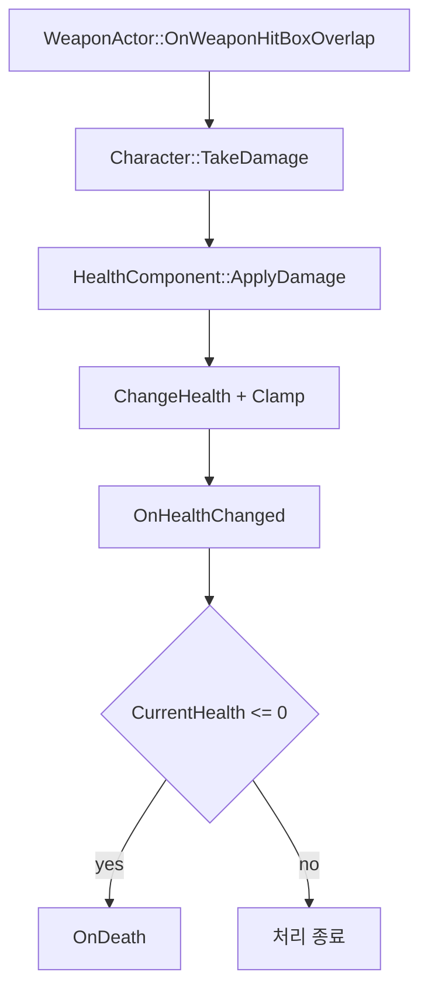
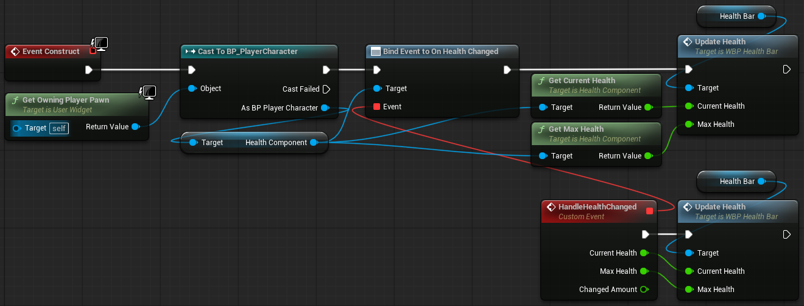

# Health and UI

## 목표

Player와 Enemy가 공통으로 사용하는 체력 상태와 변경 로직을 `UHealthComponent`로 분리하고, 체력 변경과 사망을 Delegate로 전달합니다. Character는 Damage 진입점과 자신의 사망 결과를 담당하고, UI는 Component의 값을 읽거나 `OnHealthChanged`를 구독해 표시합니다.

Player UI와 Enemy HealthBar는 표시 위치와 연결 방식이 다릅니다.

- Player: PlayerController가 Viewport UI를 생성하고, `WBP_PlayerMainUI`가 Player HealthComponent와 연결됩니다.
- Enemy: Enemy Actor에 붙은 `UHealthBarComponent`가 Owner의 HealthComponent를 찾아 Screen Space Widget을 갱신합니다.

## 최종 구조

| 구성 요소 | 책임 |
| --- | --- |
| `UHealthComponent` | Max/Current Health, Heal()/ApplyDamage(), Clamp, 변경·사망 Delegate |
| `APlayerCharacter` | Damage를 HealthComponent로 전달, 사망 시 이동 비활성화, 체력 Getter 제공 |
| `AEnemyCharacter` | Damage를 HealthComponent로 전달, 사망 시 Drop·방 알림·Destroy |
| `ARoguelikePlayerController` | Local Controller에서 Player Main UI 생성·Viewport 등록 |
| `WBP_PlayerMainUI` | Player의 HealthComponent와 연결하고 체력 변경 Delegate를 통해 Player HealthBar 갱신 |
| `WBP_HealthBar` | Player UI 내부 ProgressBar 갱신 |
| `UHealthBarComponent` | Enemy Owner의 HealthComponent 검색·Delegate 구독·Widget 갱신 |
| `UHealthBarWidget` | `PB_Health` ProgressBar의 Percent 계산 |
| `WBP_EnemyHealthBar` | `UHealthBarWidget`을 Native Parent로 사용하는 Enemy Widget Blueprint |
| `AHealItem` | Player Overlap 시 HealthComponent를 찾아 Heal 적용 후 제거 |

## 체력 변경 흐름



## HealthComponent

### 초기화

`UHealthComponent`는 Tick을 사용하지 않습니다. `BeginPlay()`에서 `CurrentHealth`를 `MaxHealth`로 설정하고 `bDead`를 초기화한 뒤, 변경량 `0.0f`로 `OnHealthChanged`를 한 번 Broadcast합니다.

```cpp
void UHealthComponent::BeginPlay()
{
    Super::BeginPlay();

    CurrentHealth = MaxHealth;
    bDead = false;

    OnHealthChanged.Broadcast(CurrentHealth, MaxHealth, 0.0f);
}
```

`MaxHealth`에는 `ClampMin = "1.0"`이 설정되어 있으며, Player와 Enemy의 기본 체력은 각 Blueprint Class에서 별도로 설정할 수 있습니다.
### Heal과 Damage

외부에는 `Heal()`과 `ApplyDamage()`를 나누어 노출하고, 실제 값 변경은 private `ChangeHealth()` 하나로 통합합니다.

```cpp
void UHealthComponent::ChangeHealth(float Amount)
{
    if (Amount == 0.0f || bDead)
        return;

    const float OldHealth = CurrentHealth;

    CurrentHealth = FMath::Clamp(
        CurrentHealth + Amount,
        0.0f,
        MaxHealth
    );

    const float ChangedAmount = CurrentHealth - OldHealth;
    if (FMath::IsNearlyZero(ChangedAmount))
        return;

    OnHealthChanged.Broadcast(
        CurrentHealth,
        MaxHealth,
        ChangedAmount
    );

    if (CurrentHealth <= 0.0f)
    {
        bDead = true;
        OnDeath.Broadcast();
    }
}
```

Delegate의 `ChangedAmount`는 요청한 값이 아니라 Clamp 적용 후 실제로 변한 체력 값입니다. 최대 체력에서 추가 Heal을 시도하는 등 실제 체력이 변하지 않은 경우에는 `OnHealthChanged`를 발생시키지 않습니다. 사망 후에는 `bDead`를 확인해 Heal과 Damage를 모두 무시합니다.
## Damage에서 사망까지

### Character의 Damage 전달

`AWeaponActor`는 대상의 `TakeDamage()`를 호출합니다. Player와 Enemy는 `Super::TakeDamage()`의 반환값이 양수인지 확인한 뒤 자신의 `UHealthComponent`에 Damage 처리를 위임합니다.

```cpp
const float ActualDamage = Super::TakeDamage(
    DamageAmount,
    DamageEvent,
    EventInstigator,
    DamageCauser
);

if (ActualDamage <= 0.0f || !CharacterHealthComponent)
    return 0.0f;

CharacterHealthComponent->ApplyDamage(ActualDamage);
```

### Player 사망

Player는 BeginPlay에서 `OnDeath`에 `Die()`를 바인딩합니다. 사망 시 `LifeState`를 `Dead`로 바꾸고 CharacterMovement를 비활성화합니다.

```cpp
void APlayerCharacter::Die()
{
    if (LifeState == ELifeState::Dead)
        return;

    LifeState = ELifeState::Dead;
    GetCharacterMovement()->DisableMovement();
}
```

### Enemy 사망

Enemy도 `OnDeath`에 `Die()`를 바인딩합니다. 사망 시 다음 순서로 처리합니다.

1. `LifeState = Dead`
2. `TryDropItem()`
3. `OnEnemyDead.Broadcast(this)`
4. `Destroy()`

`OnEnemyDead`는 `ACombatRoomBase`가 구독하며, Enemy의 사망을 추적해 전투방 클리어 여부를 판단하는 데 사용합니다. Drop은 `FMath::FRand()`와 `DropChance`를 사용하며, 지정된 Class가 있을 때 Enemy 위치 위에 Actor를 생성합니다.

## Player UI 연결

### Viewport 생성

`ARoguelikePlayerController::BeginPlay()`는 Local Controller인지 확인한 뒤 `PlayerMainUIClass`로 Widget을 생성하고 Viewport에 추가합니다.

```cpp
if (!IsLocalController() || !PlayerMainUIClass)
    return;

PlayerMainUI = CreateWidget<UUserWidget>(
    this,
    PlayerMainUIClass
);

if (PlayerMainUI)
    PlayerMainUI->AddToViewport();
```

`BP_RoguelikePlayerController`는 `WBP_PlayerMainUI`를 참조하고, `BP_GameMode`는 `BP_PlayerCharacter`와 `BP_RoguelikePlayerController`를 각각 Default Pawn/Player Controller Class로 참조합니다.

### HealthBar 갱신

`WBP_PlayerMainUI`는 `GetOwningPlayerPawn`을 통해 Player를 가져오고,
`HealthComponent`의 `OnHealthChanged`에 `HandleHealthChanged` 이벤트를 바인딩합니다.

체력 변경 시 `HandleHealthChanged(CurrentHealth, MaxHealth, ChangedAmount)`가 호출되며,
자식 `WBP_HealthBar`의 `UpdateHealth(CurrentHealth, MaxHealth)`를 통해 체력 UI를 갱신합니다.

또한 Widget 생성 시 `GetCurrentHealth()`와 `GetMaxHealth()`를 직접 조회해 초기 체력 값을 표시합니다.


## Enemy HealthBar 연결

Enemy는 생성자에서 `UHealthBarComponent`를 만들고 Root에 부착한 뒤 Z축으로 `120.0f` 올립니다. Component 자체는 다음 기본값을 가집니다.

```cpp
UHealthBarComponent::UHealthBarComponent()
{
    SetWidgetSpace(EWidgetSpace::Screen);
    SetDrawSize(FVector2D(120.0f, 12.0f));
    SetCollisionEnabled(ECollisionEnabled::NoCollision);
}
```

`BeginPlay()`에서는 특정 멤버 이름을 참조하지 않고 Owner에서 `UHealthComponent` 타입을 찾습니다.

```cpp
HealthComponent = Owner->FindComponentByClass<UHealthComponent>();

HealthComponent->OnHealthChanged.AddDynamic(
    this,
    &UHealthBarComponent::HandleHealthChanged
);

HandleHealthChanged(
    HealthComponent->GetCurrentHealth(),
    HealthComponent->GetMaxHealth(),
    0.0f
);
```

Delegate를 구독한 직후 현재 값을 직접 한 번 전달하므로, HealthComponent의 BeginPlay 초기 Broadcast보다 늦게 바인딩되더라도 초기 표시값을 설정합니다.

`HandleHealthChanged()`는 `GetUserWidgetObject()`를 `UHealthBarWidget`으로 Cast하고 `UpdateHealth()`를 호출합니다. `UHealthBarWidget`은 `BindWidget`으로 연결된 `PB_Health`의 Percent를 계산합니다.

```cpp
const float HealthPercent = MaxHealth > 0.0f
    ? CurrentHealth / MaxHealth
    : 0.0f;

PB_Health->SetPercent(HealthPercent);
```

`WBP_EnemyHealthBar`는 `UHealthBarWidget`을 Native Parent로 사용합니다. `BP_EnemyCharacter`의 `HealthBarComponent`에는 `WBP_EnemyHealthBar`가 Widget Class로 지정되어 있습니다.

## 회복 아이템 연결

`AHealItem`은 Sphere Overlap에서 PlayerCharacter를 확인하고 `FindComponentByClass<UHealthComponent>()`로 체력 컴포넌트를 찾습니다. 찾으면 `bConsumed`를 먼저 설정한 뒤 `Heal(HealAmount)`을 호출하고 자신을 Destroy합니다.

## 주요 설계 결정

* **체력 로직을 `UHealthComponent`로 통합**

  초기에는 Player와 Enemy가 각자 체력 값과 Damage 처리 로직을 가지고 있었습니다. 중복되는 체력 변경 규칙을 한곳에서 관리하기 위해 `UHealthComponent`로 분리하고, Character는 Damage를 전달하는 역할만 맡도록 구성했습니다.

* **사망 판정과 사망 후 처리를 분리**

  `UHealthComponent`는 체력이 0이 되었는지만 판단하고 `OnDeath`를 Broadcast합니다. Player의 이동 비활성화나 Enemy의 아이템 Drop·방 알림·Destroy처럼 Character마다 다른 사망 처리는 각 Character의 `Die()`에서 담당하도록 했습니다.

* **체력 UI를 이벤트 기반으로 갱신**

   UI가 매 프레임 체력 값을 확인하지 않고 `OnHealthChanged`를 구독해 실제 체력이 변경된 경우에만 갱신하도록 구성했습니다. 이를 통해 체력 계산과 UI 표시 로직을 직접 연결하지 않고 Delegate를 통해 분리했습니다.

* **Player와 Enemy의 UI 연결 방식을 분리**

  Player 체력바는 Viewport에 표시되는 `WBP_PlayerMainUI`에서 관리하고, Enemy 체력바는 Enemy Actor에 부착된 `UHealthBarComponent`를 통해 표시합니다. 화면 UI와 월드에 부착되는 UI의 사용 방식이 다르기 때문에 각 환경에 맞는 연결 구조를 사용했습니다.


## 개발 중 문제와 해결

### Player와 Enemy에 중복되어 있던 체력 로직
초기에는 Player와 Enemy가 각각 `CurrentHealth`, `MaxHealth`, `ChangeHealth()` 또는 별도의 Damage 차감 로직을 직접 가지고 있었습니다.

이후 공통 체력 로직을 `UHealthComponent`로 분리하고, Player와 Enemy가 동일한 Component를 사용하도록 변경했습니다. Character의 `TakeDamage()`는 실제 체력 처리를 `UHealthComponent`에 위임하고, 사망 처리는 `OnDeath` Delegate를 통해 각 Character의 `Die()` 함수와 연결했습니다.

회복 아이템도 Player의 체력 값을 직접 변경하지 않고 `UHealthComponent::Heal()`을 사용하도록 수정했습니다.

관련 변경: [`4b77f15`](https://github.com/want-to-sleep1212/UE5-Roguelike/commit/4b77f15797b368b39d896fcbdce1048cfb4f69a8)

###
### Enemy 체력바가 초기 체력을 표시하지 않던 문제

Enemy가 생성된 직후 체력바에 현재 체력이 정상적으로 표시되지 않는 문제가 있었습니다.

원인은 `UHealthComponent`가 `BeginPlay()`에서 초기 `OnHealthChanged`를 Broadcast한 뒤, `UHealthBarComponent`가 Delegate를 바인딩하는 경우가 있었기 때문입니다. 

이를 해결하기 위해 `OnHealthChanged` 바인딩이 끝난 직후 `GetCurrentHealth()`와 `GetMaxHealth()`로 현재 체력을 가져와 `HandleHealthChanged()`를 한 번 직접 호출하도록 수정했습니다.

## 관련 소스
- `Source/Roguelike/Components/Health/HealthComponent.h/.cpp`
- `Source/Roguelike/Characters/Player/PlayerCharacter.h/.cpp`
- `Source/Roguelike/Characters/Enemy/EnemyCharacter.h/.cpp`
- `Source/Roguelike/Core/PlayerController/RoguelikePlayerController.h/.cpp`
- `Source/Roguelike/UI/Components/HealthBarComponent.h/.cpp`
- `Source/Roguelike/UI/Widgets/HealthBarWidget.h/.cpp`
- `Source/Roguelike/Items/HealItem.h/.cpp`
