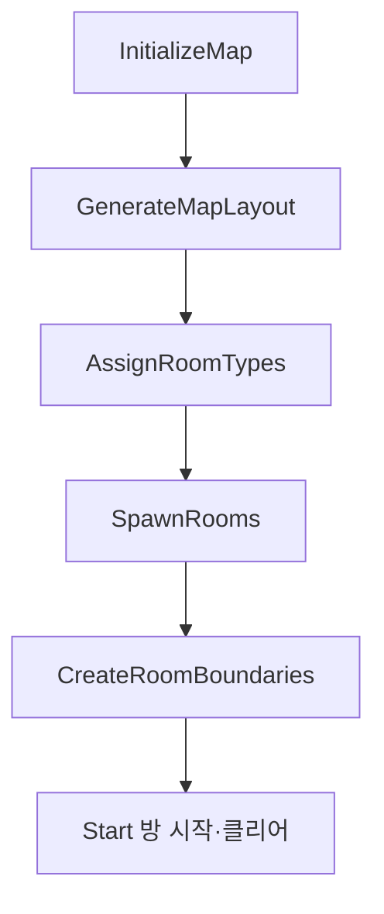

# Procedural Dungeon

## 목표

이 시스템의 역할은 다음 세 가지입니다.

- 실행 시 서로 연결된 방 배치를 생성하고 각 격자 칸을 실제 Room Actor로 변환합니다.
- 방과 방 사이 또는 던전 외곽을 구분하는 경계를 생성하고, 연결된 방 사이에는 하나의 Door를, 연결되지 않은 외곽에는 Wall을 배치합니다.
- Start, Shop, Combat, Boss 등 방 종류에 따라 시작과 클리어 동작을 처리하고 Door의 개폐를 관리합니다.

구현은 [`ARoomManager`](../Source/Roguelike/Rooms/RoomManager.h)가 전체 배치와 Actor 생성을 담당하고, [`ARoomBase`](../Source/Roguelike/Rooms/RoomBase.h) 계층이 개별 방의 상태와 행동을 담당하는 구조로 나뉩니다.

## 최종 구조

| 클래스 | 책임 |
| --- | --- |
| `ARoomManager` | 격자 초기화, Random Walk 배치, Room Type 배정, Room/Wall/Door 생성 |
| `ARoomBase` | `RoomState`, `RoomTrigger`, Door 목록, 시작·클리어 상태 전이 |
| `AStartRoomBase` | Trigger를 사용하지 않고 Manager 호출로 즉시 시작·클리어·개방 |
| `AShopRoomBase` | 플레이어 진입 시 Shop UI를 열고, 상점 종료 시 클리어·Door 개방 |
| `ACombatRoomBase` | 적 등록, 사망 Delegate 수신, 전투 시작·클리어 공통 처리 |
| `ACombatRoom` | Spawn Point를 섞고 설정 범위 안의 적을 무작위 생성 |
| `ABossRoomBase` | `BossClasses`와 Spawn Point를 순서대로 대응시켜 생성 |
| `ARoomDoor` | 열림 상태를 보관하고 가시성·Collision을 함께 전환 |


## 생성 흐름



`ARoomManager::BeginPlay()`는 위 순서를 고정해서 호출합니다. Start 방은 경계와 Door 생성이 끝난 뒤 실행됩니다.
## 맵 자료구조와 방 배치

### 2차원 격자와 Room 배열
맵은 중첩 `TArray`로 구성된 2차원 격자로 관리합니다. 각 칸에는 Room Actor를 직접 저장하지 않고 `Rooms` 배열의 Index를 저장하며, 빈 칸은 `INDEX_NONE`으로 표현합니다.

`GetRoomIndexAt()`은 해당 좌표의 Index를 반환하고, `GetRoomAt()`은 그 Index를 이용해 실제 Room Actor를 반환합니다.

### 연결성을 유지하는 Random Walk

생성은 `GridSize / 2`의 중앙 칸에서 시작합니다. 상·하·좌·우 중 한 방향을 무작위로 선택해 이동하고, 처음 방문한 칸에만 다음 Room Index를 기록합니다.

새 방은 기존 경로에서 한 칸 이동한 위치에만 추가되므로 생성된 칸은 시작 방과 연결됩니다.
## Room Type 배정

`AssignRoomTypes()`는 먼저 모든 방을 `Combat`으로 채운 다음 특수 방을 덮어씁니다.

1. 생성 Index `0`: `Start`
2. 시작 좌표로부터 BFS 최단 거리가 가장 먼 방: `Boss`
3. Start와 Boss를 제외한 후보 중 무작위 한 방: `Shop`
4. 나머지: `Combat`

`FindFarthestRoomIndex()`는 시작 방에서 BFS로 각 방까지의 최단 경로를 탐색합니다. 보스 방은 생성 순서나 직선거리가 아니라 시작 방에서 가장 먼 방을 기준으로 선택합니다.
## Room Actor 생성

`SpawnRooms()`는 격자를 순회하며 `RoomTypes[RoomIndex]`에 대응하는 Blueprint Class를 선택합니다.

격자의 중앙 칸을 `(0, 0)` 기준으로 보고 각 칸이 중심에서 X·Y 방향으로 몇 칸 떨어져 있는지 계산합니다. 그 상대 좌표에 `RoomSpacing`을 곱한 값을 `ARoomManager`의 월드 위치에 더해 각 Room Actor의 Spawn 위치를 결정합니다.
## 방 사이 연결, Wall과 Door

각 경계는 너비 1200인 Side Wall 두 개와 가운데 600 영역으로 구성됩니다. 가운데 영역은 인접 방이 있으면 Door, 없으면 Center Wall입니다.

**Center Wall**


**Center Door**


### 중복 경계 생성 방지

인접한 두 방이 같은 경계를 각각 생성하지 않도록 책임 방향을 제한합니다.

- North와 East 경계는 항상 현재 방이 생성합니다.
- South에 방이 있으면 그 방의 North가 생성하므로 생략합니다.
- West에 방이 있으면 그 방의 East가 생성하므로 생략합니다.
- South/West가 외곽이면 현재 방이 벽을 생성합니다.

### Door 공유

연결된 경계에서는 Door Actor를 한 번만 생성하고 같은 포인터를 양쪽 방에 등록합니다.

```cpp
ARoomDoor* Door = GetWorld()->SpawnActor<ARoomDoor>(
    DoorClass,
    BoundaryCenter,
    Rotation
);

Room->RegisterDoor(Door);
ConnectedRoom->RegisterDoor(Door);
```

연결된 두 방은 같은 Door Actor를 제어하므로 Door 상태가 서로 어긋나지 않습니다.

## 방 상태와 진행

공통 상태는 `ERoomState`에 정의되어 있습니다.

```cpp
enum class ERoomState : uint8
{
    Waiting,
    InProgress,
    Cleared
};
```

`ARoomBase::StartRoom()`은 `Waiting`일 때만 `InProgress`로, `ClearRoom()`은 `InProgress`일 때만 `Cleared`로 전환합니다. Trigger는 `Player` 채널만 Overlap합니다.

방 타입별 진행은 다음과 같습니다.

| 방 타입 | 시작 방식 | 시작 후 처리 | 클리어 조건 |
| --- | --- | --- | --- |
| Start | `ARoomManager`가 직접 호출 | Start와 Clear를 연속 수행하고 Door 개방 | 즉시 |
| Shop | Player Trigger | Shop UI 표시 | Shop UI 종료 |
| Combat | Player Trigger | 적 생성 후 Door 폐쇄 | 등록된 적이 모두 사망 |
| Boss | Player Trigger | Boss 생성 후 Door 폐쇄 | 등록된 Boss가 모두 사망 |

## CombatRoom과 BossRoom의 Spawn 구조

### 공통 적 생명주기

`ACombatRoomBase::RegisterEnemy()`는 생성된 적을 `AliveEnemies`에 추가하고 `AEnemyCharacter::OnEnemyDead`에 `NotifyEnemyDead()`를 바인딩합니다. 사망 알림을 받은 적을 배열에서 제거하고, 배열이 비면 방을 클리어합니다.

```cpp
AliveEnemies.Add(Enemy);
Enemy->OnEnemyDead.AddDynamic(this, &ACombatRoomBase::NotifyEnemyDead);

// NotifyEnemyDead
AliveEnemies.Remove(Enemy);
if (AliveEnemies.IsEmpty())
    ClearRoom();
```

### 일반 전투방

Spawn Point는 전투방에서 적이 생성될 위치를 나타냅니다. `ACombatRoom`은 `EnemySpawnPoint` 태그가 지정된 `USceneComponent`를 수집하고, 수집한 Spawn Point 배열의 순서를 무작위로 섞습니다.

설정된 `MinEnemyCount`와 `MaxEnemyCount`가 배치된 Spawn Point 수를 넘지 않도록 제한한 뒤, 제한된 범위에서 생성할 적의 수를 무작위로 정합니다. 이후 섞인 Spawn Point를 순서대로 사용하여 각 위치에 적을 생성합니다.
### 보스방

`ABossRoomBase`는 `BossClasses`와 Spawn Point 배열을 같은 Index로 대응시킵니다. 이를 통해 여러 보스를 생성할 때 각 보스를 대응되는 Spawn Point에서 생성되도록 구성했습니다.

생성 수는 `BossClasses`와 Spawn Point 배열 중 더 작은 크기로 제한하여, 두 배열의 개수가 다르더라도 서로 짝이 맞는 항목까지만 사용합니다.
## 주요 설계 결정
- **공통 상태 전이는 Base에서 관리**  
  `StartRoom()`과 `ClearRoom()`의 기본 상태 전이는 `ARoomBase`에서 처리하고, 파생 방은 성공 여부를 확인한 뒤 방 타입에 맞는 동작만 추가합니다. 이를 통해 `Waiting → InProgress → Cleared` 흐름을 방마다 반복해서 구현하지 않도록 했습니다.
- **공유 경계는 한 번만 생성**  
  인접한 두 방이 같은 Wall이나 Door를 중복 생성하지 않도록 방향별 생성 책임을 제한했습니다. Door는 연결된 두 방에 Actor 하나만 생성하여 양쪽 방에 같은 문을 등록해 상태가 서로 어긋나지 않도록 했습니다.

- **Spawn Point는 Blueprint에서 배치**  
  C++은 `EnemySpawnPoint` 태그가 붙은 Component를 수집하고, 실제 위치는 각 Room Blueprint에서 조정합니다. 방 구조가 달라져도 C++ 코드를 수정하지 않고 적 생성 위치를 변경할 수 있습니다.
- **Seed 기반 던전 재현**  
  절차적 던전 생성 과정은 `FRandomStream`을 사용하도록 구성했습니다. 실행 시 사용한 Seed를 로그로 남기고, 필요할 경우 동일한 Seed를 지정하여 같은 던전 배치와 랜덤 방 선택 결과를 재현할 수 있습니다.  
  이를 통해 랜덤 생성 과정에서 문제가 발생했을 때 동일한 조건으로 다시 실행하여 원인을 확인할 수 있도록 했습니다.
## 개발 중 문제와 해결
### 공유 경계 중복 생성 문제
초기에는 인접한 두 방이 같은 위치에 벽과 문을 중복 생성해 서로 겹쳐져서 배치되는 문제가 있었습니다.

이를 해결하기 위해 경계 생성 책임을 방향 별로 나눴습니다. 각 방은 기본적으로 North와 East 경계만 생성하고, South와 West는 인접 방이 없는 외곽일 때만 생성하도록 변경했습니다.

그 결과 인접한 두 방 사이의 경계는 한 번만 생성되며, 연결된 경우 Side Wall 두 개와 Door 하나만 배치됩니다.
## 관련 소스

- `Source/Roguelike/Rooms/RoomManager.h/.cpp`
- `Source/Roguelike/Rooms/RoomBase.h/.cpp`
- `Source/Roguelike/Rooms/RoomDoor.h/.cpp`
- `Source/Roguelike/Rooms/StartRoomBase.h/.cpp`
- `Source/Roguelike/Rooms/ShopRoomBase.h/.cpp`
- `Source/Roguelike/Rooms/CombatRoomBase.h/.cpp`
- `Source/Roguelike/Rooms/CombatRoom.h/.cpp`
- `Source/Roguelike/Rooms/BossRoomBase.h/.cpp`
- `Source/Roguelike/Core/Types/RoomStates.h`
- `Content/Rooms/Blueprints/*.uasset`
