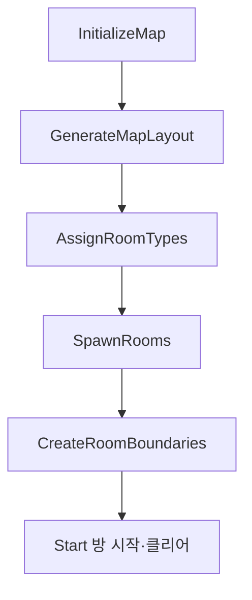
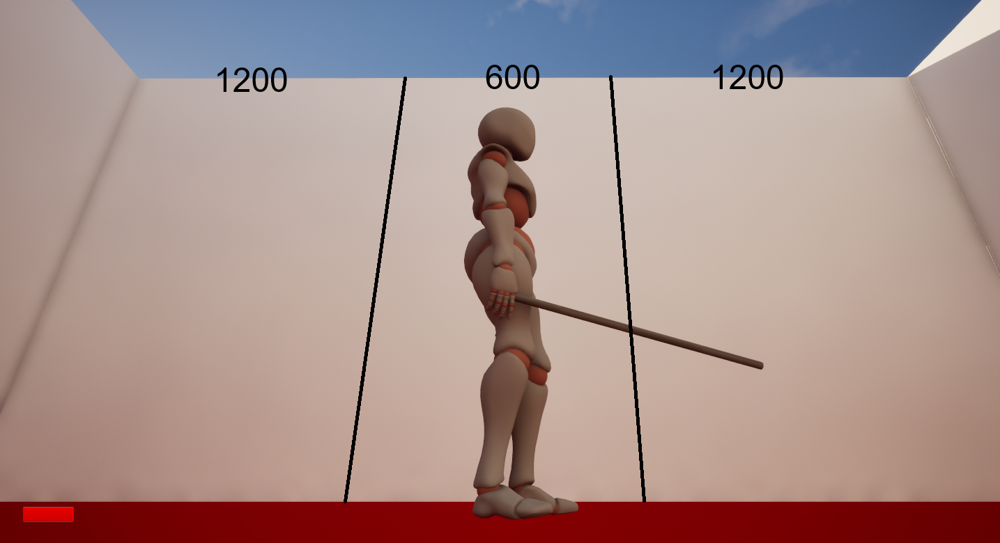
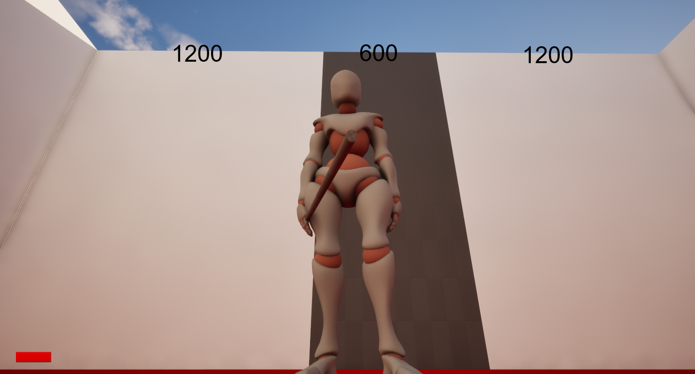

# Procedural Dungeon

## 목표

이 시스템의 역할은 다음 세 가지입니다.

- 실행 시 서로 연결된 방 배치를 생성하고 각 격자 칸을 실제 Room Actor로 변환합니다.
- 방의 공유 경계에는 하나의 Door를, 외곽 경계에는 Wall을 생성합니다.
- 방 타입과 방 상태를 연결하여 전투방 입장부터 적 전멸·문 개방까지 진행을 관리합니다.

구현은 [`ARoomManager`](../Source/Roguelike/Rooms/RoomManager.h)가 전체 배치와 Actor 생성을 담당하고, [`ARoomBase`](../Source/Roguelike/Rooms/RoomBase.h) 계층이 개별 방의 상태와 행동을 담당하는 구조로 나뉩니다.

## 최종 구조

| 클래스 | 책임 |
| --- | --- |
| `ARoomManager` | 격자 초기화, Random Walk 배치, Room Type 배정, Room/Wall/Door 생성 |
| `ARoomBase` | `RoomState`, `RoomTrigger`, Door 목록, 공통 시작·클리어 상태 전이 |
| `AStartRoomBase` | Trigger를 사용하지 않고 Manager 호출로 즉시 시작·클리어·개방 |
| `AShopRoomBase` | 플레이어 진입 시 즉시 클리어하고 Door 개방 |
| `ACombatRoomBase` | 적 등록, 사망 Delegate 수신, 전투 시작·클리어 공통 처리 |
| `ACombatRoom` | Spawn Point를 섞고 설정 범위 안의 적을 무작위 생성 |
| `ABossRoomBase` | `BossClasses`와 Spawn Point를 순서대로 대응시켜 생성 |
| `ARoomDoor` | 열림 상태를 보관하고 가시성·Collision을 함께 전환 |


## 생성 흐름



`ARoomManager::BeginPlay()`는 위 순서를 고정해서 호출합니다. Start 방을 여는 호출은 경계와 Door 생성이 끝난 뒤 실행됩니다.

```cpp
void ARoomManager::BeginPlay()
{
    Super::BeginPlay();

    InitializeMap();
    GenerateMapLayout();
    AssignRoomTypes();
    SpawnRooms();
    CreateRoomBoundaries();
    
    int32 StartRoomIndex = 0;

    Rooms[StartRoomIndex]->StartRoom();
}
```

## 맵 자료구조와 방 배치

### 2차원 격자와 Room 배열

맵은 중첩 `TArray`로 보관합니다.

```cpp
// Map[Y][X] = Rooms 배열의 Index
// 빈 칸 = INDEX_NONE
TArray<TArray<int32>> Map;

UPROPERTY()
TArray<TObjectPtr<ARoomBase>> Rooms;
```

`Map`에는 Actor 포인터를 직접 저장하지 않고 `Rooms` 배열의 Index를 저장합니다. `GetRoomIndexAt()`은 Index를, `GetRoomAt()`은 Index로 실제 Actor를 반환합니다. 유효하지 않은 좌표와 빈 칸은 `INDEX_NONE` 또는 `nullptr`로 처리합니다.

### 연결성을 유지하는 Random Walk

생성은 `GridSize / 2`의 중앙 칸에서 시작합니다. 상·하·좌·우 중 한 방향을 무작위로 선택해 이동하고, 처음 방문한 칸에만 다음 Room Index를 기록합니다.

```cpp
const int32 MaxRoomCount = GridSize * GridSize;
const int32 RoomCount = FMath::Min(TargetRoomCount, MaxRoomCount);

int32 CurrentX = GridSize / 2;
int32 CurrentY = GridSize / 2;
Map[CurrentY][CurrentX] = GeneratedRoomCount++;

while (GeneratedRoomCount < RoomCount)
{
    const int32 DirectionIndex = FMath::RandRange(0, 3);
    const int32 NextX = CurrentX + Directions[DirectionIndex].X;
    const int32 NextY = CurrentY + Directions[DirectionIndex].Y;

    if (!IsValidPosition(NextX, NextY))
        continue;

    CurrentX = NextX;
    CurrentY = NextY;

    if (Map[CurrentY][CurrentX] == INDEX_NONE)
        Map[CurrentY][CurrentX] = GeneratedRoomCount++;
}
```

새 방은 기존 경로에서 한 칸 이동한 위치에만 추가되므로 생성된 칸은 시작 방과 연결됩니다. `TargetRoomCount`는 격자의 최대 칸 수를 넘지 않도록 제한됩니다.

## Room Type 배정

`AssignRoomTypes()`는 먼저 모든 방을 `Combat`으로 채운 다음 특수 방을 덮어씁니다.

1. 생성 Index `0`: `Start`
2. 시작 좌표로부터 BFS 최단 거리가 가장 큰 방: `Boss`
3. Start와 Boss를 제외한 후보 중 무작위 한 방: `Shop`
4. 나머지: `Combat`

```cpp
RoomTypes.Init(ERoomType::Combat, GeneratedRoomCount);
RoomTypes[0] = ERoomType::Start;

const int32 BossRoomIndex = FindFarthestRoomIndex();
if (BossRoomIndex != INDEX_NONE && BossRoomIndex != 0)
    RoomTypes[BossRoomIndex] = ERoomType::Boss;

const int32 ShopRoomIndex = FindRandomRoomIndexExcept(ExcludedRoomIndices);
if (ShopRoomIndex != INDEX_NONE)
    RoomTypes[ShopRoomIndex] = ERoomType::Shop;
```

`FindFarthestRoomIndex()`는 `Distances` 배열과 `TQueue<FIntPoint>`를 사용해 방이 배치된 칸만 BFS로 탐색합니다. 보스 방은 생성 순서나 직선거리가 아니라 시작 방에서의 격자 최단 경로 거리를 기준으로 선택합니다.
## Room Actor 생성

`SpawnRooms()`는 격자를 순회하며 `RoomTypes[RoomIndex]`에 대응하는 Blueprint Class를 선택합니다. 중앙 칸이 Manager 위치가 되도록 상대 좌표를 계산하고, 각 칸을 `RoomSpacing`만큼 떨어뜨립니다.

```cpp
const int32 Center = GridSize / 2;
const int32 RelativeX = X - Center;
const int32 RelativeY = Y - Center;

const FVector SpawnLocation = GetActorLocation() + FVector(
    RelativeX * RoomSpacing,
    RelativeY * RoomSpacing,
    0.1f
);
```

## 방 사이 연결, Wall과 Door

각 경계는 너비 1200인 Side Wall 두 개와 가운데 600 영역으로 구성됩니다. 가운데 영역은 인접 방이 있으면 Door, 없으면 Center Wall입니다.

**Center Wall**



**Center Door**



### 중복 경계 생성 방지

인접한 두 방이 같은 경계를 각각 생성하지 않도록 책임 방향을 제한합니다.

- North와 East 경계는 항상 현재 방이 생성합니다.
- South에 방이 있으면 그 방의 North가 이미 생성하므로 생략합니다.
- West에 방이 있으면 그 방의 East가 이미 생성하므로 생략합니다.
- South/West가 외곽이면 현재 방이 Wall 경계를 생성합니다.

### Door 공유

연결된 경계에서는 Door Actor를 한 번만 생성하고 같은 포인터를 양쪽 방에 등록합니다.

```cpp
ARoomDoor* Door = GetWorld()->SpawnActor<ARoomDoor>(
    DoorClass,
    BoundaryCenter,
    Rotation
);

Room->RegisterDoor(Door);
ConnectedRoom->RegisterDoor(Door);
```

연결된 두 방은 같은 Door Actor를 제어하므로 Door 상태가 서로 어긋나지 않습니다

`ARoomDoor::OpenDoor()`는 Actor를 숨기고 Collision을 끄며, `CloseDoor()`는 두 값을 다시 활성화합니다. 
## 방 상태와 진행

공통 상태는 `ERoomState`에 정의되어 있습니다.

```cpp
enum class ERoomState : uint8
{
    Waiting,
    InProgress,
    Cleared
};
```

`ARoomBase::StartRoom()`은 `Waiting`일 때만 `InProgress`로, `ClearRoom()`은 `InProgress`일 때만 `Cleared`로 전환합니다. Trigger는 `Player` 채널만 Overlap합니다.

방 타입별 진행은 다음과 같습니다.

| 방 타입 | 시작 방식 | 시작 후 처리 | 클리어 조건 |
| --- | --- | --- | --- |
| Start | `ARoomManager`가 직접 호출 | Start와 Clear를 연속 수행하고 Door 개방 | 즉시 |
| Shop | Player Trigger | Clear 후 Door 개방 | 즉시 |
| Combat | Player Trigger | 적 생성 후 Door 폐쇄 | 등록된 적이 모두 사망 |
| Boss | Player Trigger | Boss 생성 후 Door 폐쇄 | 등록된 Boss가 모두 사망 |

## CombatRoom과 BossRoom의 Spawn 구조

### 공통 적 생명주기

`ACombatRoomBase::RegisterEnemy()`는 생성된 적을 `AliveEnemies`에 추가하고 `AEnemyCharacter::OnEnemyDead`에 `NotifyEnemyDead()`를 바인딩합니다. 사망 알림을 받은 적을 배열에서 제거하고, 배열이 비면 방을 클리어합니다.

```cpp
AliveEnemies.Add(Enemy);
Enemy->OnEnemyDead.AddDynamic(this, &ACombatRoomBase::NotifyEnemyDead);

// NotifyEnemyDead
AliveEnemies.Remove(Enemy);
if (AliveEnemies.IsEmpty())
    ClearRoom();
```

### 일반 전투방

`ACombatRoom`은 `EnemySpawnPoint` 태그가 지정된 `USceneComponent`를 수집합니다.

Spawn Point 배열을 `Algo::RandomShuffle()`로 섞고, `MinEnemyCount`와 `MaxEnemyCount`를 실제 Spawn Point 개수에 맞게 보정한 뒤 무작위 수만큼 앞에서부터 사용합니다.

```cpp
Algo::RandomShuffle(SpawnPoints);

const int32 ValidMinEnemyCount = FMath::Clamp(
    MinEnemyCount, 0, SpawnPoints.Num()
);
const int32 ValidMaxEnemyCount = FMath::Clamp(
    MaxEnemyCount, ValidMinEnemyCount, SpawnPoints.Num()
);
const int32 EnemyCount = FMath::RandRange(
    ValidMinEnemyCount, ValidMaxEnemyCount
);
```


### 보스방

`ABossRoomBase`는 `BossClasses`와 Spawn Point 배열을 같은 Index로 대응시킵니다. 생성 수는 두 배열 크기 중 작은 값으로 제한하므로, Class 또는 Spawn Point가 더 많아도 유효한 쌍만 생성합니다.

```cpp
const int32 SpawnCount = FMath::Min(
    BossClasses.Num(),
    SpawnPoints.Num()
);
```


## 주요 설계 결정


- **공통 상태 전이는 Base에서 관리**  
  `StartRoom()`과 `ClearRoom()`의 기본 상태 전이는 `ARoomBase`에서 처리하고, 파생 방은 성공 여부를 확인한 뒤 방 타입에 맞는 동작만 추가합니다. 이를 통해 `Waiting → InProgress → Cleared` 흐름을 방마다 반복해서 구현하지 않도록 했습니다.
- **공유 경계는 한 번만 생성**  
  인접한 두 방이 같은 Wall이나 Door를 중복 생성하지 않도록 방향별 생성 책임을 제한했습니다. Door는 연결 하나당 Actor 하나만 생성하고 양쪽 Room에 같은 Door를 등록해 상태가 서로 어긋나지 않도록 했습니다.

- **Spawn Point는 Blueprint에서 배치**  
  C++은 `EnemySpawnPoint` 태그가 붙은 Component를 수집하고, 실제 위치는 각 Room Blueprint에서 조정합니다. 방 구조가 달라져도 C++ 코드를 수정하지 않고 적 생성 위치를 변경할 수 있습니다.
## 개발 중 문제와 해결

### 공유 경계 중복 생성 문제

초기에는 인접한 두 방이 서로 같은 경계를 각각 생성하면서 Wall과 Door가 겹쳐 배치되는 문제가 있었습니다.

이를 해결하기 위해 경계 생성 책임을 방향 별로 나눴습니다. 각 방은 기본적으로 North와 East 경계만 생성하고, South와 West는 인접 방이 없는 외곽일 때만 생성하도록 변경했습니다.

그 결과 인접한 두 방 사이의 경계는 한 번만 생성되며, 연결된 경우 Side Wall 두 개와 Door 하나만 배치됩니다.


## 관련 소스

- `Source/Roguelike/Rooms/RoomManager.h/.cpp`
- `Source/Roguelike/Rooms/RoomBase.h/.cpp`
- `Source/Roguelike/Rooms/RoomDoor.h/.cpp`
- `Source/Roguelike/Rooms/StartRoomBase.h/.cpp`
- `Source/Roguelike/Rooms/ShopRoomBase.h/.cpp`
- `Source/Roguelike/Rooms/CombatRoomBase.h/.cpp`
- `Source/Roguelike/Rooms/CombatRoom.h/.cpp`
- `Source/Roguelike/Rooms/BossRoomBase.h/.cpp`
- `Source/Roguelike/Core/Types/RoomStates.h`
- `Content/Rooms/Blueprints/*.uasset`
