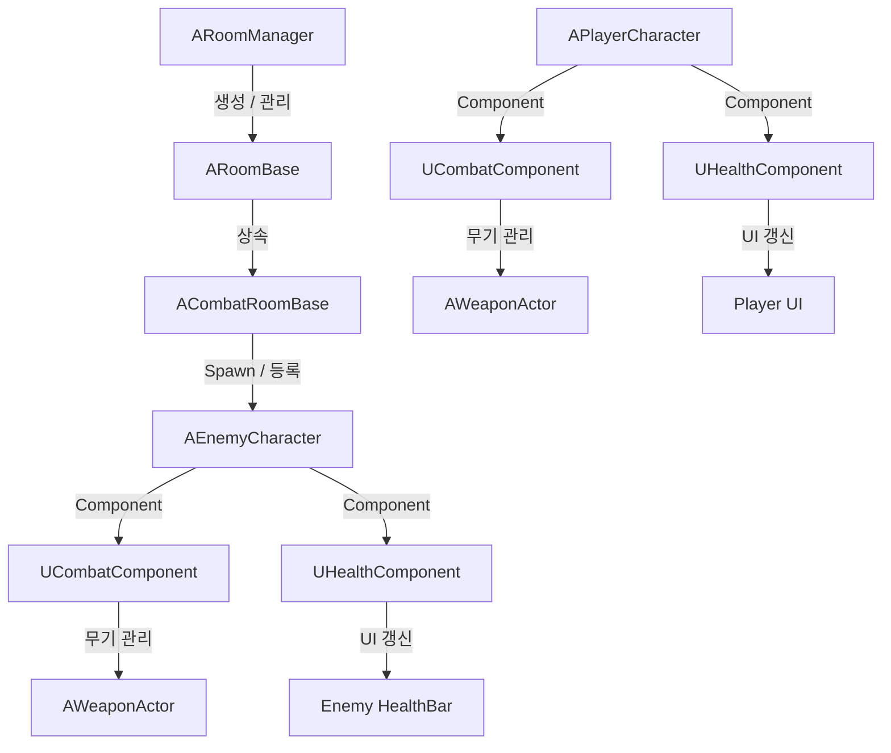
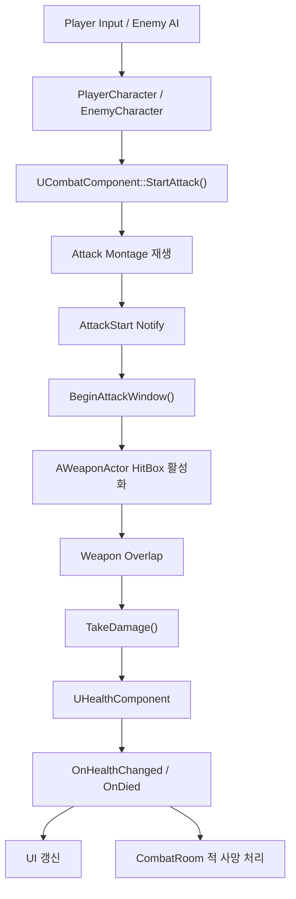

# UE5 Roguelike

Unreal Engine 5 C++로 구현한 로그라이크 프로토타입입니다. 실행 시 격자 위에 연결된 방을 생성하고, 시작·전투·상점·보스 방을 배정한 뒤 벽과 공유 문을 구성합니다. 플레이어와 적은 같은 전투·체력 컴포넌트를 사용하며, 전투방에서는 입장 시 적을 생성하고 모든 적이 사망하면 문을 다시 엽니다.

## 개발 환경 및 기술

| 구분 | 저장소에서 확인된 내용 |
| --- | --- |
| Engine | Unreal Engine 5.7 |
| Gameplay | Actor Component, Delegate, Interface, Enhanced Input |
| AI | AIController, Blackboard, Behavior Tree, C++ Service/Task |
| UI | UMG, UserWidget, WidgetComponent |
| 기본 맵 | `Content/Maps/TestMap.umap` |

## 핵심 시스템

| 시스템 | 구현 요약 | 상세 문서 |
| --- | --- | --- |
| 절차적 방 생성 | 2차원 격자와 Random Walk로 연결된 배치를 만들고, 시작점 기준 BFS 거리로 보스 방을 정합니다. | [Procedural Dungeon](Docs/ProceduralDungeon.md) |
| 방 진행 | `Waiting → InProgress → Cleared` 상태와 문 제어를 `ARoomBase` 계층에서 관리합니다. | [Procedural Dungeon](Docs/ProceduralDungeon.md#방-상태와-진행) |
| 공용 전투 구조 | 플레이어와 적이 `UCombatComponent`를 공유하고, 캐릭터별 공격 가능 조건은 `ICombatStateInterface`로 분리합니다. | [Combat System](Docs/CombatSystem.md) |
| 애니메이션 기반 타격 | Montage의 `AttackStart`/`AttackEnd` Notify 구간에만 무기 HitBox를 활성화합니다. | [Combat System](Docs/CombatSystem.md#공격-동작-흐름) |
| 적 AI | Blackboard의 목표와 공격 범위 상태를 Behavior Tree의 이동·회전·공격 노드에서 사용합니다. | [Enemy AI](Docs/EnemyAI.md) |
| 체력과 UI | 체력 변경과 사망을 `UHealthComponent`에 모으고 Delegate로 캐릭터 및 UI에 전달합니다. | [Health & UI](Docs/HealthAndUI.md) |

##  전체 구조

프로젝트의 주요 시스템은 **던전/방 관리**, **캐릭터 전투**, **체력 및 UI** 세 영역으로 나뉩니다.

### 클래스 및 책임 구조

* `ARoomManager`는 2차원 격자 맵 생성, 방 타입 배정, Room Actor 생성과 벽·문 구성을 담당합니다.
* `ARoomBase`는 개별 방의 `Waiting → InProgress → Cleared` 상태와 Door 개폐를 관리합니다.
* `ACombatRoomBase`는 전투방에서 적을 생성하고 등록하며, 적 사망을 추적해 전멸 시 방을 클리어합니다.
* `APlayerCharacter`와 `AEnemyCharacter`는 각각 `UCombatComponent`와 `UHealthComponent`를 사용합니다.
* `UCombatComponent`는 공격 상태와 장착 무기를 관리하고, `AWeaponActor`는 공격 구간의 충돌과 Damage 전달을 담당합니다.
* `UHealthComponent`는 체력 변경과 사망 이벤트를 관리하며 Delegate를 통해 캐릭터 및 UI에 상태 변화를 전달합니다.

### 전투 실행 흐름

클래스 간 소유 관계와 별개로, 실제 공격은 다음 순서로 진행됩니다.

공격 시작 시 `UCombatComponent`가 공격 상태를 변경하고 Montage를 재생합니다. Montage의 `AttackStart` Notify가 호출되면 실제 타격 판정 구간이 시작되며, 이때만 `AWeaponActor`의 HitBox가 활성화됩니다.

무기가 다른 Actor와 Overlap하면 Unreal의 Damage 전달 경로를 통해 대상 Character에 Damage가 전달되고, 대상의 `UHealthComponent`가 실제 체력 값을 변경합니다.

체력 변경과 사망은 Delegate로 전달되므로 UI 갱신과 캐릭터 사망 처리, 전투방의 적 전멸 판단을 체력 계산 로직과 분리할 수 있습니다.

## 플레이 흐름

1. `ARoomManager::BeginPlay()`가 맵을 초기화하고 연결된 방 배치를 생성합니다.
2. 첫 방은 Start, 시작점에서 최단 경로 거리가 가장 먼 방은 Boss, 나머지 후보 중 하나는 Shop, 그 외는 Combat 타입으로 배정합니다.
3. 각 격자 좌표에 방 Actor를 생성하고, 인접 여부에 따라 벽 또는 Door를 배치합니다. 인접한 두 방은 같은 `ARoomDoor` 인스턴스를 공유합니다.
4. Start 방은 RoomManager가 직접 시작·클리어하여 출구를 열고, 다른 방은 플레이어가 `RoomTrigger`에 진입하면 시작합니다.
5. Combat/Boss 방은 진입 시 Spawn Point에서 적을 생성하고 문을 닫습니다.
6. 플레이어 또는 AI가 공격 Montage를 재생하면 Notify 구간에만 Weapon HitBox가 활성화됩니다.
7. 무기의 Overlap이 `TakeDamage()`로 전달되고, `UHealthComponent`가 체력 변경과 사망 Delegate를 발생시킵니다.
8. 방에 등록된 모든 적이 사망하면 방이 `Cleared` 상태가 되고 문이 다시 열립니다.

## 기술 문서

- [절차적 던전 및 방 진행 구조](Docs/ProceduralDungeon.md)
- [플레이어·적 공용 전투 구조](Docs/CombatSystem.md)
- [Blackboard·Behavior Tree 기반 적 AI](Docs/EnemyAI.md)
- [체력 컴포넌트와 Player/Enemy UI 연결](Docs/HealthAndUI.md)

## 대표 소스 위치

| 영역 | 주요 경로 |
| --- | --- |
| 던전 생성 | `Source/Roguelike/Rooms/RoomManager.h`, `RoomManager.cpp` |
| 방 상태·문 | `Source/Roguelike/Rooms/RoomBase.*`, `RoomDoor.*` |
| 전투방·보스방 | `Source/Roguelike/Rooms/CombatRoomBase.*`, `CombatRoom.*`, `BossRoomBase.*` |
| 플레이어·적 | `Source/Roguelike/Characters/Player/PlayerCharacter.*`, `Characters/Enemy/EnemyCharacter.*` |
| 전투·무기 | `Source/Roguelike/Components/Combat/CombatComponent.*`, `Weapons/WeaponActor.*` |
| 적 AI | `Source/Roguelike/AI/EnemyAIController.*`, `BTService_CheckAttackRange.*`, `BTTask_Attack.*` |
| 체력 | `Source/Roguelike/Components/Health/HealthComponent.*` |
| UI | `Source/Roguelike/UI/**`, `Core/PlayerController/RoguelikePlayerController.*` |
| Blueprint/BT | `Content/Rooms/Blueprints`, `Content/AI`, `Content/UI/Widgets`, `Content/Characters/**/Animations` |

